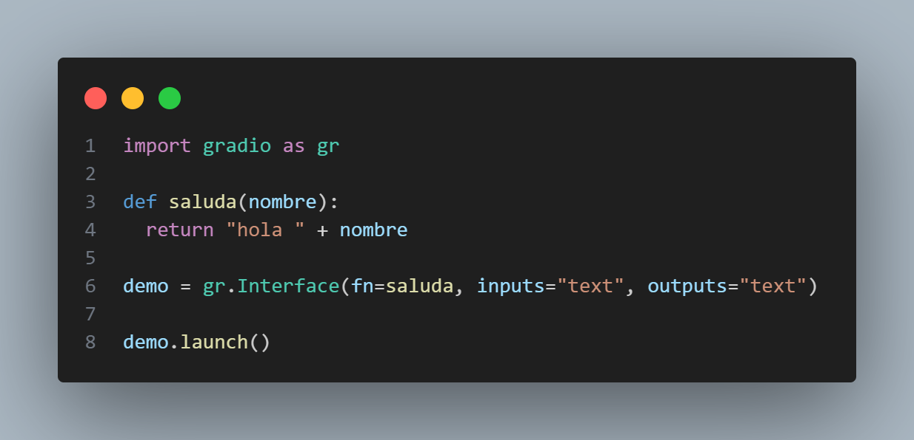

# [Curso de Experimentación en Machine Learning con Hugging Face](https://platzi.com/cursos/demos-machine-learning/) (Etiqueta bibliográfica personalizada `emlhf`)

## Módulo 1: Introducción al Hub de Hugging Face

1. Video *Explorando los Spaces*
  
   ### Recursos

   - [www.gradio.app](https://www.gradio.app/)

---

## Módulo 2: Gradio

2. Video *Introducción a Gradio*  

3. Video *Tus primeros demos con Gradio*  
  
   - Sección "Demo básico"
  
     
  
     Respuesta del script:
  
     

     Cada uso de la interfaz de gradio se registra en un archivo CSV, creado automáticamente al lanzar el script
     > Platzi_codes\emlhf\v03\.gradio\flagged\dataset1.csv

     
  
   - Sección "Demo básico con Gradio con caja de texto personalizada"
  
     
  
     Respuesta del script:
  
     
  
   Recursos:
   - [Quickstart - gradio](https://www.gradio.app/guides/quickstart)
     - [Este es el mismo ejemplo del video 3 - Building Your First Demo](https://www.gradio.app/guides/quickstart#building-your-first-demo)
   - [https://www.gradio.app/docs](https://www.gradio.app/docs)
   - [Platzi Community - huggingface](https://huggingface.co/platzi)

4. Video *Demos para clasificación de imágenes con Gradio*  
  
   Las lineas de código del archivo del video están obsoleas y no corren por lo que fue necesario renovarlo, despues de este código se presenta la renovación
  
   
  
   RENOVADO

   
  
   [¿Qué hacen estas lineas?](v04_modelo_MobileNetV2_de_TensorFlow.md)

5. Video *Compartir demos en Spaces de Hugging Face*

6. Video *Demo de transcripción de audio a texto con Gradio*

7. Video *El futuro de los demos: Blocks*

8. Video *Blocks con Tabs y TabItem*

9.  Video *Gradio (cierre)*

---

## Módulo 3: Streamlit

10. Video *Introducción a Streamlit*

11. Video *Primeros pasos con Streamlit*

12. Video *Demo de generación de imágenes con Streamli*

13. Video *Creando interfaz de demo de GAN*

14. Video *Probando demo de generación de imágenes*

15. Video *Configurar un demo clonado desde Hugging Face*

16. Video *Streamlit (cierre)*

---

## Módulo 4: Tu historia en Machine Learning

17. Video *Sube tus propios demos

18. Video *Comparte tu proyecto de un demo de ML y certifícate
