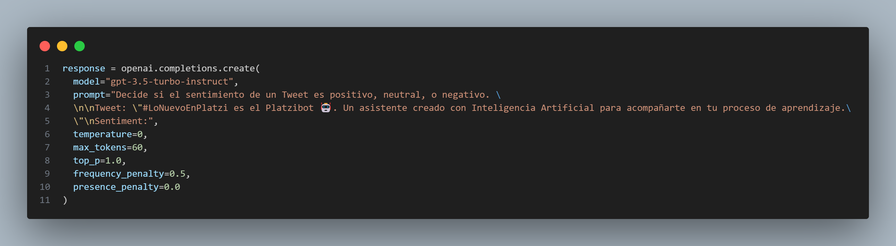
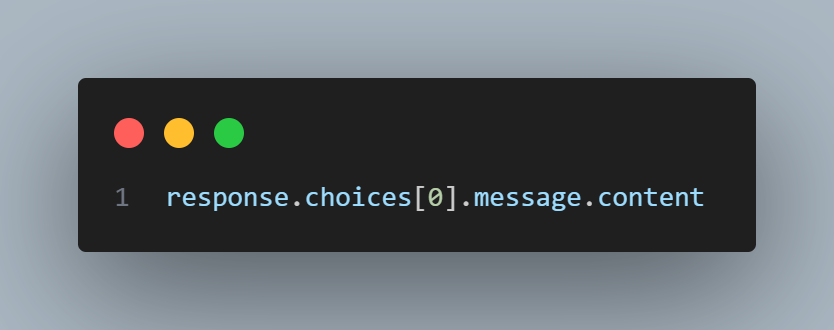

# Curso de Desarrollo de Chatbots con OpenAI (oaib)

## [Desarrollo del archivo oaib_v01_tweets_classifier_original.ipynb](../../../Platzi_codes/oaib/v01/oaib_v01_tweets_classifier_original.ipynb)

### Sección "Clasificador de Tweets con Completion API (Legacy)"

[¿Qué hacen estas líneas?](v01-script01.md)

- [Qué tipos de modelos maneja openai actualmente?](v01-script01_Tipos_de_modelos_de_OpenAI.md)
  - [Qué diferencias principales hay entre los “Modelos de Chat” y los “Modelos de Completions”?](v01-script01_diferencias“Modelos_de_Chat”y“Modelos_de_Completions”.md)

- [Principales familias de modelos de OpenAI, un modelo representativo, y sus precios vigentes (junio de 2025)](v01-script01_familias_modelos_OpenAI.md)

- [Desarrollo más profundo de la teoría detrás de top_p (también conocido como nucleus sampling) y su interacción con otros parámetros de generación como temperature](v01-script01_temperature,top_p,frequency_penalty,presence_penalty.md)

  - [Tabla con los principales parámetros de generación de texto en la API de OpenAI y sus rangos de valores permitidos (vigentes a junio de 2025)](v01-script01_rangos-temperature,top_p,frequency_penalty,presence_penalty.md)

#### Recursos del video

- https://platform.openai.com/examples/default-tweet-classifier

---

[Muestra de la estructura interna completa de la respuesta que devuelve el endpoint de `Chat Completions`](v01-script01_estructura_interna_endpoint_de_Chat_Completions.md)

#### Recursos del video

- 
---

## [Desarrollo del archivo ""](../../../Platzi_codes/oaib/v01/oaib_v01_tweets_classifier_original.ipynb)

### Sección ""

## Comentarios
