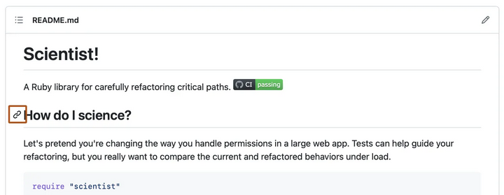
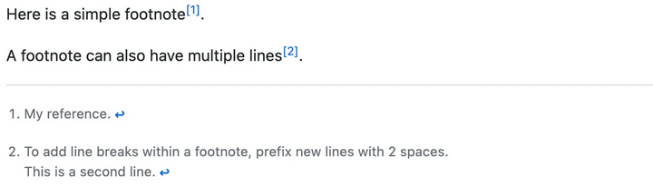
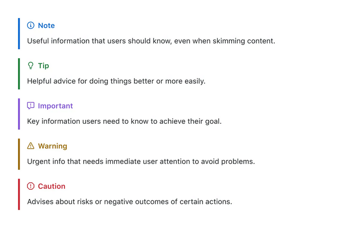

# Sintaxis de escritura y formato básicos de Markdown

## Estilos de texto

Puedes indicar énfasis con texto en negrita, cursiva, tachado, o de subíndice o superíndice en los campos de comentarios y archivos `.md`.

| Estilo                           | Sintaxis           | Métodos abreviados de teclado             | Ejemplo                                           | Resultado                                         |
|----------------------------------|--------------------|-------------------------------------------|---------------------------------------------------|---------------------------------------------------|
|Subíndice                        | `<sub> </sub>`     | Ninguno                                   | `This is a <sub>subscript</sub> text`            | Se trata de un texto de <sub>subíndice</sub>                 |
| Superíndice                      | `<sup> </sup>`     | Ninguno                                   | `This is a <sup>superscript</sup> text`          | Se trata de un texto de <sup>superíndice</sup>               |
| Subrayado                        | `<ins> </ins>`     | Ninguno                                   | `This is an <ins>underlined</ins> text`          | Se trata de un texto <ins>subrayado</ins>                    |

## Enlaces de sección

Puede vincular directamente a cualquier sección que tenga un encabezado. Para ver el delimitador generado automáticamente en un archivo representado, mantén el puntero sobre el encabezado de sección para exponer el icono de enlace y haz clic en él para mostrar el ancla en el navegador.




Si necesitas determinar el ancla de un encabezado en un archivo que estás editando, puedes usar las siguientes reglas básicas:

1. Las letras se convierten a minúsculas.  
2. Los espacios se reemplazan por guiones (`-`). Se eliminan cualquier otro espacio en blanco o carácter de puntuación.  
3. Se eliminan espacios en blanco iniciales y finales.  
4. Se elimina el formato de marcado, dejando solo el contenido (por ejemplo, `_italics_` se convierte en `italics`).  
5. Si el ancla generada automáticamente para un encabezado es idéntica a otra previa en el mismo documento, se añade un sufijo `-1`, `-2`, etc., para que cada ancla sea única.

> Para más detalles sobre los fragmentos de URI, consulta [RFC 3986: sección 3.5](https://www.rfc-editor.org/rfc/rfc3986#section-3.5).

El bloque de código siguiente muestra cómo se generan anclas a partir de encabezados:

```markdown
# Example headings

## Sample Section

## This'll be a _Helpful_ Section About the Greek Letter Θ!
A heading containing characters not allowed in fragments, UTF-8 characters, two consecutive spaces between the first and second words, and formatting.

## This heading is not unique in the file

TEXT 1

## This heading is not unique in the file

TEXT 2

# Links to the example headings above

Link to the sample section: [Link Text](#sample-section).

Link to the helpful section: [Link Text](#thisll-be-a-helpful-section-about-the-greek-letter-Θ).

Link to the first non-unique section: [Link Text](#this-heading-is-not-unique-in-the-file).

Link to the second non-unique section: [Link Text](#this-heading-is-not-unique-in-the-file-1).
```

> [!NOTE]
> Si edita un encabezado o cambia el orden de los encabezados con anclas "idénticas", también deberá actualizar los vínculos a esos encabezados, ya que las anclas cambiarán.

## Anclas personalizadas

Puede usar etiquetas de anclaje HTML estándar (`<a name="unique-anchor-name"></a>`) para crear puntos de anclaje de navegación para cualquier ubicación del documento. Para evitar referencias ambiguas, use un esquema de nomenclatura único para etiquetas de anclaje, como agregar un prefijo al valor de atributo `name`.

> [!NOTE]  
> Las anclas personalizadas no se incluirán en el esquema o tabla de contenido del documento.

Puedes vincular a una ancla personalizada mediante el valor de atributo `name` que proporcionó el ancla. La sintaxis es exactamente la misma que cuando se vincula a una ancla que se genera automáticamente para un encabezado.

Por ejemplo:

```markdown
# Section Heading

Some body text of this section.

<a name="my-custom-anchor-point"></a>
Some text I want to provide a direct link to, but which doesn't have its own heading.

(… more content…)

[A link to that custom anchor](#my-custom-anchor-point)
```

> [!TIP]
> Las anclas personalizadas no se tienen en cuenta por el comportamiento automático de nomenclatura y numeración de vínculos de encabezado automático.

## Saltos de línea

Si está escribiendo en problemas, en solicitudes de extracción o en discusiones de un repositorio, GitHub generará un salto de línea automáticamente:

```markdown
This example
Will span two lines
```

Sin embargo, si está escribiendo en un archivo `.md`, el ejemplo anterior se representaría en una línea sin salto. Para crear un salto de línea en un archivo `.md`, deberá incluir uno de los elementos siguientes:

- Incluya dos espacios al final de la primera línea.

  ```markdown
  This example  
  Will span two lines
  ```

- Incluya una barra diagonal inversa al final de la primera línea.

  ```markdown
  This example\
  Will span two lines
  ```

- Incluya una etiqueta de salto de una sola línea HTML al final de la primera línea.

  ```markdown
  This example<br/>
  Will span two lines
  ```

Si deja una línea en blanco entre dos líneas, tanto los archivos `.md` como Markdown en problemas, en solicitudes de extracción y en discusiones mostrarán las dos líneas separadas por la línea en blanco:

```markdown
This example
Will have a blank line separating both lines
```

## Imágenes

Puede mostrar una imagen agregando `!` y ajustando el texto alternativo en `[ ]`. El texto alternativo es un texto corto equivalente a la información de la imagen. Luego, escribe el vínculo de la imagen entre paréntesis `()`.

```markdown

````

GitHub admite la inserción de imágenes en incidencias, solicitudes de cambio, debates, comentarios y archivos `.md`. Puedes mostrar una imagen desde tu repositorio, agregar un enlace a una imagen en línea o cargar una imagen. Para obtener más información, consulta la sección **Carga de recursos**. ([docs.github.com][1])

> [!NOTE]
> Cuando quieras mostrar una imagen incluida en el repositorio, usa vínculos relativos en vez de absolutos.

Aquí tienes algunos ejemplos de rutas relativas para mostrar una imagen:

| Contexto                                                                       | Enlace relativo                                                        |
| ------------------------------------------------------------------------------ | ---------------------------------------------------------------------- |
| En un archivo `.md` de la misma rama                                           | `/assets/images/electrocat.png`                                        |
| En un archivo `.md` de otra rama                                               | `../main/assets/images/electrocat.png`                                 |
| En propuestas, solicitudes de cambio y comentarios del mismo repositorio       | `../blob/main/assets/images/electrocat.png?raw=true`                   |
| En un archivo `.md` de otro repositorio                                        | `/../../../../github/docs/blob/main/assets/images/electrocat.png`      |
| En propuestas, solicitudes de cambio y comentarios de otro repositorio privado | `../../../github/docs/blob/main/assets/images/electrocat.png?raw=true` |

> [!NOTE]
> Los últimos dos vínculos relativos de la tabla anterior funcionarán únicamente para las imágenes de repositorios privados si el lector tiene (como mínimo) acceso de lectura.

Para obtener más información, consulte [Vínculos relativos](https://docs.github.com/es/get-started/writing-on-github/getting-started-with-writing-and-formatting-on-github/basic-writing-and-formatting-syntax#relative-links).

### Elemento de imagen

Se admite el elemento HTML `<picture>`. ([docs.github.com][1])

[1]: https://docs.github.com/es/get-started/writing-on-github/getting-started-with-writing-and-formatting-on-github/basic-writing-and-formatting-syntax "Sintaxis de escritura y formato básicos - Documentación de GitHub"

## Listas de tareas

Para crear una lista de tareas, debe añadir como prefijo un guion y espacio, seguido de `[ ]` a los elementos de la lista. Para marcar una tarea como completada, use `[x]`.

```markdown
- [x] #739
- [ ] https://github.com/octo-org/octo-repo/issues/740
- [ ] Add delight to the experience when all tasks are complete :tada:
```

Si la descripción de un elemento de la lista de tareas comienza por un paréntesis, necesitará agregar el carácter de escape `\`:

```markdown
- [ ] \(Optional) Open a followup issue
```

Para más información, consulta [About tasklists](https://docs.github.com/en/get-started/writing-on-github/working-with-advanced-formatting/about-tasklists).

## Notas al pie

Puedes agregar notas al pie para tu contenido si utilizas esta sintaxis de corchetes:

```markdown
Here is a simple footnote[^1].
A footnote can also have multiple lines[^2].
[^1]: My reference.  
[^2]: To add line breaks within a footnote, prefix new lines with 2 spaces.  
  This is a second line.
```

La nota al pie se verá así (con superíndice para la referencia y texto al final):  



> [!NOTE]  
> La posición de una nota al pie de página en Markdown no influye en dónde se representará la nota; puedes escribir la definición de la nota al pie después de referenciarla, y GitHub la mostrará al final del archivo. Las notas al pie no se admiten en las wikis.

## Alertas

Las alertas son una extensión Markdown basada en la sintaxis blockquote que puede utilizar para resaltar la información crítica. En GitHub, se muestran con colores e iconos distintivos para indicar la importancia del contenido.

Deben usarse las alertas solo cuando sean cruciales para el éxito del usuario y limitarlas a una o dos por artículo para evitar sobrecargar al lector. Además, debe evitarse colocar alertas consecutivamente. Las alertas no se pueden anidar dentro de otros elementos.

Para agregar una alerta, debe usarse una línea blockquote especial que especifique el tipo de alerta, seguida de la información de alerta en un blockquote estándar. Existen cinco tipos de alertas.

```markdown
> [!NOTE]
> Useful information that users should know, even when skimming content.

> [!TIP]
> Helpful advice for doing things better or more easily.

> [!IMPORTANT]
> Key information users need to know to achieve their goal.

> [!WARNING]
> Urgent info that needs immediate user attention to avoid problems.

> [!CAUTION]
> Advises about risks or negative outcomes of certain actions.
```

Estas son las alertas representadas:



## Ocultar el contenido con comentarios

Puedes indicarle a GitHub que oculte el contenido del Markdown representado si colocas el contenido en un comentario HTML.

```html
<!-- This content will not appear in the rendered Markdown -->
```

## Ignorar formato de Markdown

Puedes indicarle a GitHub que ignore (u omita) el formato de Markdown si usas `\` antes del carácter de Markdown.

```markdown
Let's rename \*our-new-project\* to \*our-old-project\*.
````


Para obtener más información, consulta la [Sintaxis de Markdown](https://daringfireball.net/projects/markdown/syntax) de Daring Fireball.

> [!NOTE]
> El formato de Markdown no se omitirá en el título de un problema o de una solicitud de incorporación de cambios.

## Otras referencia

- [Trabajar con formato avanzado](https://docs.github.com/es/get-started/writing-on-github/working-with-advanced-formatting)
  - [Crear diagramas](https://docs.github.com/es/get-started/writing-on-github/working-with-advanced-formatting/creating-diagrams)
