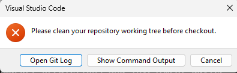

# Git Stash: Guardar Cambios Temporalmente para Limpiar tu Repositorio



Este mensaje de Visual Studio Code:

> **"Please clean your repository working tree before checkout."**

Significa que **tienes archivos modificados o sin guardar** en tu repositorio local, y Git **no puede hacer el `pull` o `checkout` hasta que limpies el estado actual del proyecto**.

## 🧠 ¿Qué significa "clean your working tree"?

Significa que debes resolver alguno de estos estados:

1. Archivos modificados y **no guardados (`unstaged`)**
2. Archivos **no confirmados (`uncommitted`)**
3. Archivos nuevos **no añadidos al control de versiones**

## ✅ Opciones para continuar

### 🔸 Opción 2: Guardar los cambios sin confirmar (stash)

Si quieres hacer el pull pero **guardar temporalmente tus cambios**:

```bash
git stash
git pull
git stash pop  # para recuperar tus cambios después del pull
```

### 🔍 Recomendación inmediata

1. Abre la terminal integrada en VSCode.
2. Ejecuta:

   ```bash
   git status
   ```

   Esto te dirá **qué archivos están pendientes o modificados**.
3. Decide si los quieres guardar (`add + commit`), guardar temporalmente (`stash`), o descartar (`reset`).

Perfecto. Vamos a explicar bien qué es y cómo funciona **`git stash`**, porque es una herramienta muy útil cuando necesitas **interrumpir tu trabajo sin perderlo**, especialmente como en tu caso, cuando Git te impide hacer un `pull` o `checkout`.

---
---

## 🧠 ¿Qué es `git stash`?

`git stash` **guarda temporalmente** los cambios que has hecho en tu área de trabajo (archivos modificados y no confirmados) **para que tu repositorio quede limpio**, y puedas hacer cosas como:

* Cambiar de rama
* Hacer `git pull`
* Hacer `git checkout`
* Ejecutar otros comandos sin perder tu trabajo

## 🛠️ ¿Qué hace internamente?

* Mueve tus archivos modificados a un área temporal ("stash stack").
* Restaura tu árbol de trabajo al último `commit` limpio.
* Tu repositorio queda como si no hubieras tocado nada.

## ✅ Comandos básicos

### 🔹 Guardar cambios actuales (stash)

```bash
git stash
```

Esto guarda los cambios **sin necesidad de commit**, y deja la carpeta limpia.

> 🧠 Equivale a decir: "Guárdame esto un momento, pero no lo borres".

### 🔹 Ver lo que has stasheado

```bash
git stash list
```

Verás algo como:

```plaintext
stash@{0}: WIP on main: 4e3b21d mensaje del último commit
```

### 🔹 Recuperar los cambios guardados

```bash
git stash pop
```

Esto **restaura tus cambios** y además los **elimina del stash**.

Si quieres recuperarlos sin borrarlos del stash (por si algo sale mal), usa:

```bash
git stash apply
```

### 🔹 Eliminar lo guardado (si ya no lo necesitas)

```bash
git stash drop stash@{0}
```

O para eliminar todo el historial de stashes:

```bash
git stash clear
```

## 🧪 Ejemplo típico en tu caso

```bash
git stash          # guarda tus cambios actuales
git pull           # ya puedes hacer pull sin error
git stash pop      # recuperas tus cambios luego del pull
```

---
---

¡Sí! En Git puedes tener **varios `stash` almacenados al mismo tiempo**. Git los guarda como una **pila (stack)**, y cada vez que haces `git stash`, se apilan uno sobre otro.

## ✅ ¿Cómo funciona?

### 🔹 Guardar múltiples cambios

```bash
git stash  # Guarda el primer conjunto de cambios
git stash  # Guarda otro conjunto
git stash  # Otro más...
```

Cada vez que haces `git stash`, se guarda un nuevo "snapshot" del estado actual.

### 🔍 Ver la lista de todos los stash guardados

```bash
git stash list
```

Salida típica:

```plaintext
stash@{0}: WIP on main: cambios recientes sobre README
stash@{1}: WIP on dev: pruebas con embeddings
stash@{2}: WIP on langc: ajustes en el notebook langc_v01
```

### 🔹 Aplicar un stash específico (sin borrar)

```bash
git stash apply stash@{1}
```

### 🔹 Aplicar y borrar (pop) uno específico

```bash
git stash pop stash@{1}
```

> 🔁 Después de aplicar un stash con `pop`, ese stash **se elimina** del historial.

### 🗑️ Eliminar un stash específico

```bash
git stash drop stash@{2}
```

### 🧨 Borrar todos los stash

```bash
git stash clear
```

## 🧠 ¿Para qué sirve tener varios?

* Puedes trabajar en diferentes ideas sin confirmar nada.
* Guardas estados intermedios mientras cambias de rama o integras cambios externos (`pull`/`merge`).
* Puedes "volver atrás" a un punto específico de tu trabajo temporal.

### ⚠️ Archivos nuevos (untracked) no se guardan por defecto ⚠️

Cuando usas `git stash`, **por defecto solo guarda los archivos que ya están bajo control de versiones** (tracked). Los archivos nuevos —como notebooks, documentos, o cualquier archivo no añadido con `git add`— no se incluirán a menos que lo especifiques.

Para incluir también estos archivos nuevos en el stash, usa:

```bash
git stash push -u -m "WIP: incluir archivos nuevos"
```

| Opción | Descripción                                      |
| ------ | ------------------------------------------------ |
| `-u`   | Incluye archivos untracked (nuevos, no añadidos) |
| `-m`   | Permite etiquetar o describir el stash           |

> 🧠 Esto guarda *todo tu trabajo actual* (modificado y nuevo) en un único stash.

### ⚠️ ¿Y si ya hiciste un stash sin `-u`?

No puedes modificar un stash existente. Lo ideal es:

1. Recuperarlo con `git stash pop`
2. Rehacer el stash completo:

```bash
git stash push -u -m "WIP: stash completo incluyendo nuevos archivos"
```

---
---

¡Sí! En Git puedes **asignar nombres o etiquetas** a tus `stash` usando una descripción, aunque Git no lo llama literalmente “nombre”, sino un **mensaje personalizado**.

## ✅ Cómo asignar una etiqueta o nombre a un `stash`

```bash
git stash push -m "nombre-descriptivo-del-stash"
```

### 🧪 Ejemplo

```bash
git stash push -m "ajustes notebook langc_v01"
```

Esto guarda tus cambios y cuando hagas `git stash list` verás algo como:

```plaintext
stash@{0}: On main: ajustes notebook langc_v01
```

## 🔍 Ver los stashes con nombres

```bash
git stash list
```

Te muestra la lista con tus mensajes personalizados:

```plaintext
stash@{0}: On main: ajustes notebook langc_v01
stash@{1}: On main: pruebas embeddings con faiss
```

## 🚫 Lo que no se puede

No puedes asignarle un “nombre clave” al estilo de etiquetas (`git tag`) o ramas (`git branch`). Solo puedes dar **descripciones legibles**, no identificadores únicos reutilizables.

## 💡 Consejo práctico

Usa una convención en tus mensajes, por ejemplo:

```bash
git stash push -m "WIP: langc - pruebas vectorstore"
```

Así puedes reconocer fácilmente qué stash aplicar más adelante.
