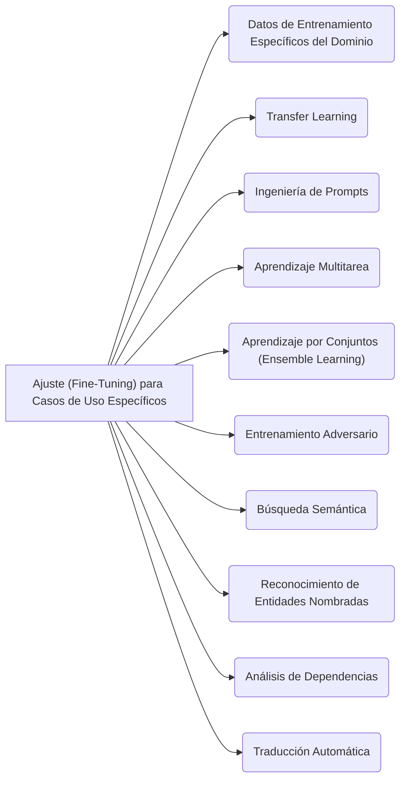

## Ajuste (Fine-Tuning) para Casos de Uso Específicos

El **ajuste (fine-tuning)** para casos de uso específicos es un proceso crucial en el desarrollo de modelos de lenguaje, incluyendo los Modelos de Lenguaje Grandes (LLM), los modelos Transformer y la Generación Aumentada por Recuperación (RAG). Consiste en adaptar un modelo preentrenado a una tarea o dominio particular, añadiendo capas específicas para la tarea o modificando las existentes.

### Propósito del Ajuste para Casos de Uso Específicos

Los modelos de lenguaje preentrenados, aunque se entrenan con vastos conjuntos de datos de texto general, a menudo tienen dificultades con el lenguaje y los requisitos específicos de un dominio. Esto se debe a que el entrenamiento general puede no capturar la terminología y los conceptos específicos utilizados en un dominio particular. El fine-tuning busca mejorar el rendimiento del modelo en estos casos de uso específicos.

### Técnicas para el Ajuste (Fine-Tuning)

Se emplean diversas técnicas para adaptar los modelos a tareas específicas:

- **Datos de entrenamiento específicos del dominio**: Entrenar el modelo con un gran conjunto de datos de texto propio del dominio es una de las formas más efectivas para que el modelo aprenda la terminología, los conceptos y los matices del lenguaje de ese dominio. Por ejemplo, un modelo médico podría entrenarse con historiales de pacientes o revistas médicas.

- **Aprendizaje por transferencia (Transfer Learning)**: Esta técnica utiliza un modelo preentrenado como punto de partida y lo adapta al dominio específico mediante entrenamiento adicional. Al aprovechar el conocimiento adquirido en la tarea de preentrenamiento, se mejora el rendimiento del modelo en la tarea objetivo con menos datos. Es una práctica común con los modelos Transformer.

- **Ingeniería de _prompts_ (Prompt Engineering)**: Consiste en diseñar _prompts_ de entrada personalizados y adaptados al caso de uso específico, utilizándolos para entrenar el modelo y que funcione bien en esa tarea.

- **Aprendizaje multitarea (Multi-task Learning)**: Implica entrenar un único modelo en múltiples tareas simultáneamente, con el objetivo de mejorar su rendimiento en todas ellas al aprovechar el conocimiento y las características compartidas.

- **Aprendizaje en conjunto (Ensemble Learning)**: Combina las predicciones de múltiples modelos para producir mejores resultados. Por ejemplo, se pueden entrenar varios modelos en diferentes subconjuntos de datos y combinar sus predicciones para mejorar la precisión general.

- **Entrenamiento adversario (Adversarial Training)**: Entrena el modelo con una mezcla de ejemplos limpios y ejemplos adversarios (diseñados para manipular las predicciones del sistema) para mejorar su robustez frente a ataques.

- **Búsqueda semántica (Semantic Search)**: Entrena el modelo para tareas que requieren una comprensión profunda del significado semántico del texto, como la búsqueda de documentos relevantes basada en su contenido.

- **Reconocimiento de entidades nombradas (Named Entity Recognition)**: Entrena el modelo para identificar y clasificar entidades nombradas en el texto (personas, organizaciones, ubicaciones).

- **Análisis de dependencias (Dependency Parsing)**: Entrena el modelo para identificar las relaciones entre las palabras en una oración (ej., relaciones sujeto-verbo-objeto).

- **Traducción automática (Machine Translation)**: Entrena el modelo para traducir texto de un idioma a otro, con el fin de mejorar su precisión y fluidez.

### Ajuste en el Contexto de LLM y Transformer

La literatura fuente detalla cómo el fine-tuning es fundamental para los modelos Transformer y los LLM populares:

- **Modelos preentrenados**: LLM populares como **BERT**, **RoBERTa** y **XLNet** son modelos preentrenados que luego se **ajustan para tareas específicas**. BERT, por ejemplo, se preentrena en grandes corpus de texto de manera agnóstica a la tarea, y luego se ajusta para tareas de nivel inferior añadiendo una capa de salida específica.
- **Arquitectura Transformer**: La arquitectura Transformer en sí misma facilita el fine-tuning. El preentrenamiento en grandes conjuntos de datos permite que el modelo aprenda características generales útiles, y el fine-tuning lo adapta a los requisitos específicos de la tarea.
- **Prácticas de ajuste de Transformers**: Implica optimizar los hiperparámetros (tasa de aprendizaje, tamaño de batch, número de épocas), el preentrenamiento del modelo en un gran corpus de texto, el ajuste fino para el conjunto de datos y la tarea específicos, y la evaluación del rendimiento. También se mencionan las modificaciones específicas de la tarea y el aprendizaje multitarea.

### Ajuste en el Contexto de RAG AI

Los modelos RAG, que combinan mecanismos de recuperación y modelos generativos, también se benefician enormemente del fine-tuning:

- **Necesidad de ajuste**: Los modelos RAG preentrenados pueden no rendir de manera óptima en escenarios específicos debido a las diferencias en los datos y los requisitos.
- **Técnicas de ajuste para RAG**:
    - **Preprocesamiento de datos**: Esencial para limpiar, normalizar y transformar los datos para alinearlos mejor con la arquitectura del modelo y el proceso de entrenamiento.
    - **Ajuste del modelo (Model Tuning)**: Ajustar los hiperparámetros del modelo RAG preentrenado (como la tasa de aprendizaje, el tamaño del lote y el número de épocas) para adaptarlos a los datos y requisitos específicos de la tarea.
    - **Aprendizaje por transferencia (Transfer Learning)**: Utilizar un modelo RAG preentrenado como punto de partida y adaptarlo a nuevas tareas o dominios, lo que reduce la cantidad de datos de entrenamiento necesarios.
    - **Aprendizaje en conjunto (Ensemble Learning)**: Combinar múltiples modelos RAG para mejorar el rendimiento general, útil para conjuntos de datos o tareas complejos.
    - **Aprendizaje activo (Active Learning)**: Seleccionar activamente las muestras más informativas para que el modelo las clasifique, reduciendo la necesidad de etiquetado manual y mejorando el rendimiento con grandes conjuntos de datos o recursos limitados.
    - **Adaptación de dominio (Domain Adaptation)**: Adaptar un modelo preentrenado a un nuevo dominio o tarea para mejorar su rendimiento.
    - **Aprendizaje multimodal (Multi-Modal Learning)**: Combinar múltiples modalidades (texto, imágenes) para crear un modelo RAG más robusto y preciso.
    - **Técnicas de explicabilidad (Explainability Techniques)**: Entender cómo el modelo realiza las predicciones para optimizar su rendimiento.

### Beneficios del Ajuste

El fine-tuning ofrece múltiples beneficios, incluyendo:

- **Rendimiento mejorado**: Permite que los modelos se adapten y sobresalgan en tareas y dominios específicos donde un modelo general podría fallar.
- **Conocimiento del dominio**: El modelo aprende la terminología y los patrones únicos de un área especializada.
- **Mayor control**: Ofrece un mayor control sobre el proceso de entrenamiento para necesidades específicas.
- **Eficiencia**: Permite el desarrollo de modelos de alto rendimiento con un esfuerzo mínimo, especialmente cuando se parte de modelos preentrenados.
- **Generalización mejorada**: Al ajustar el modelo a un conjunto de datos más diverso y representativo del dominio, se puede mejorar su capacidad para generalizar a datos no vistos dentro de ese dominio.

En resumen, el fine-tuning es una metodología esencial en la "Implementación de su modelo de lenguaje" que permite a los LLM, modelos Transformer y RAG **trascender las capacidades generales** para las que fueron preentrenados, y **adaptarse de manera efectiva a los requisitos detallados y matizados de casos de uso específicos**, asegurando su relevancia y rendimiento óptimo en aplicaciones del mundo real.

