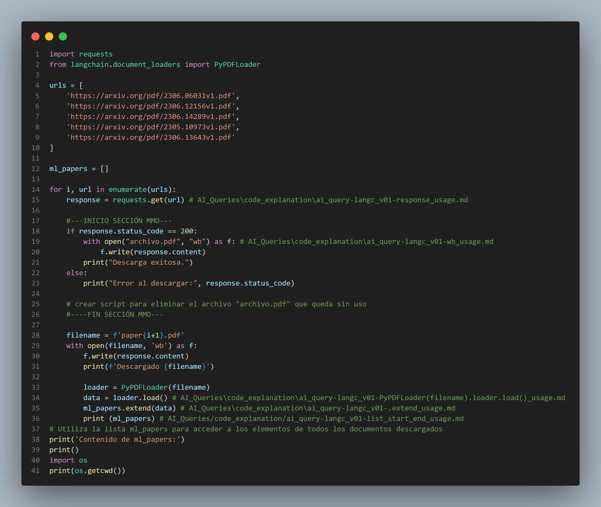
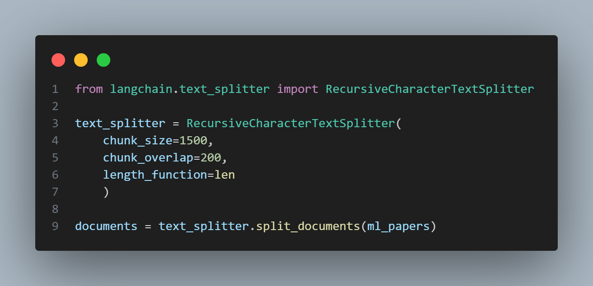

# 📁 [AI_Queries/code_explanation/](../AI_Queries/code_explanation/)

Esta carpeta contiene archivos Markdown (`.md`) que documentan explicaciones técnicas de fragmentos de código utilizados en el proyecto.

Su propósito es servir como una fuente de referencia para comprender funciones, estructuras, flujos lógicos y configuraciones implementadas, así como para registrar conocimientos adquiridos durante el desarrollo.

**Contenido típico**

- Análisis de bloques de código complejos o reutilizables.
- Explicación de funciones propias o de terceros.
- Justificación de decisiones técnicas.
- Respuestas a consultas técnicas realizadas durante la implementación.
- Buenas prácticas, ejemplos, o aclaraciones sobre errores comunes.

Esta carpeta ayuda a mantener la trazabilidad y comprensión del código, facilitando el mantenimiento y la colaboración futura en el proyecto.  

**Estructura de nombres de archivos**

Los archivos siguen una convención de nombres con tres componentes separados por guiones (`-`):

```plaintext
[origen] - [fuente] - [tema].md
```

- **`ai_query`**: indica que el contenido del archivo proviene de una consulta realizada a un modelo de inteligencia artificial (por ejemplo, ChatGPT).  
- **`langc_v01`**: identifica la fuente o contexto en el que surgió la consulta, como un archivo `.ipynb`, video, notebook, documento técnico, etc.  
- **`response_usage.md`**: especifica el tema tratado en el archivo, como el uso de una función, comportamiento de una clase, configuración, etc.

Ejemplo:

```text
ai_query-langc_v01-response_usage.md
```

Este archivo contiene una respuesta generada por IA, relacionada con el uso de una función, surgida al trabajar con el archivo `langc_v01.ipynb`.

## Curso de Langchain [langc]

- 

  - [Funcionamiento del `for` combinado con el `enumerate` en langc_v01.ipynb](../AI_Queries/code_explanation/ai_query-langc_v01-for_usage.md)
    - Message Commit: `Code_Example-langc_v01: Desarrollo de codigo de ejemplo del video 1 de langc - Author: maodecolombia`
  - [¿Qué hace `response`?](../AI_Queries/code_explanation/ai_query-langc_v01-response_usage.md)
  - [¿Por qué `lista[:2]` **no incluye el índice 2**?](../AI_Queries/code_explanation/ai_query-langc_v01-list_start_end_usage.md)
  - [¿Qué es `.extend()`?](../AI_Queries/code_explanation/ai_query-langc_v01-.extend_usage.md)
  - [¿Qué es loader?](../AI_Queries/code_explanation/ai_query-langc_v01-PyPDFLoader(filename).loader.load()_usage.md)
  - [¿Para qué es el  wd en `with open("archivo.pdf", "wb") as f:`](../AI_Queries/code_explanation/ai_query-langc_v01-wb_usage.md)


- 
  - [`chunk_size` y `chunk_overlap` de `from langchain.text_splitter import RecursiveCharacterTextSplitter`](../AI_Queries/code_explanation/ai_query-langc_v01-chunk_usage.md)
    - [¿que significac la afirmacion "Estos límites incluyen tanto el texto de entrada (prompt) como la respuesta generada por el modelo"?](../AI_Queries/code_explanation/ai_query-langc_v01-meaning_inputpromptandanswer.md)
      - [¿A qué hace referecia "retrieval"?](../AI_Queries/code_explanation/ai_query-langc_v01-retrieval_meaning.md)
  - El script maneja 1500 caracteres pero cuanto sería el máximo chunk en función de los tokens para modelos de ChatGPT [¿Cuántos tokens acepta cada modelo de ChatGPT?](../AI_Queries/code_explanation/ai_query-langc_v01-max_tokens_Chatgptmodels.md)